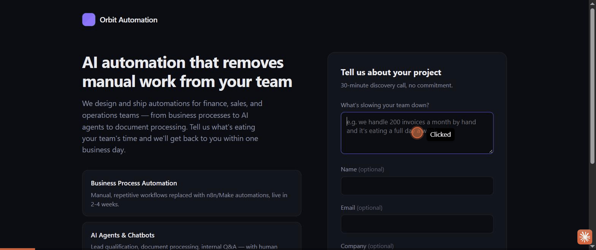
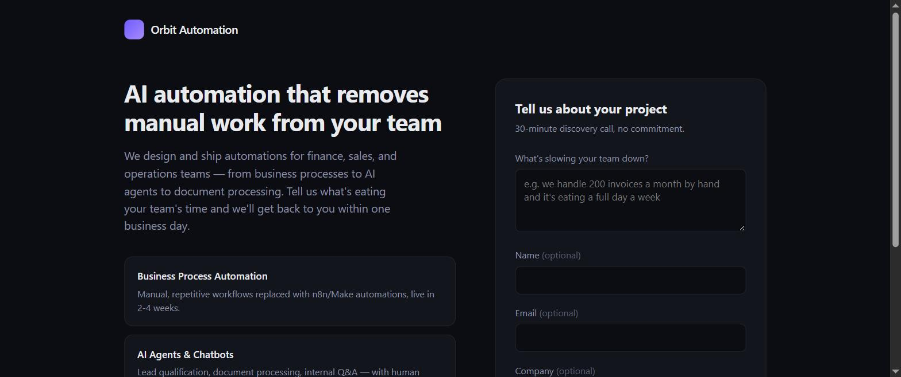
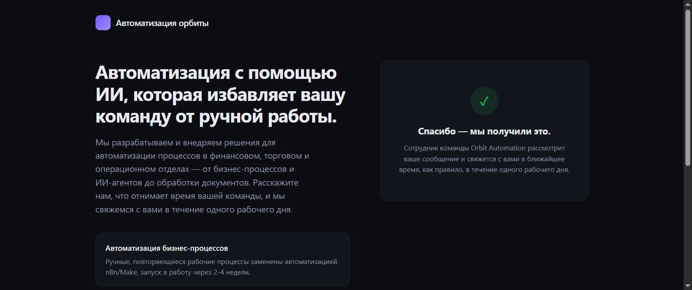
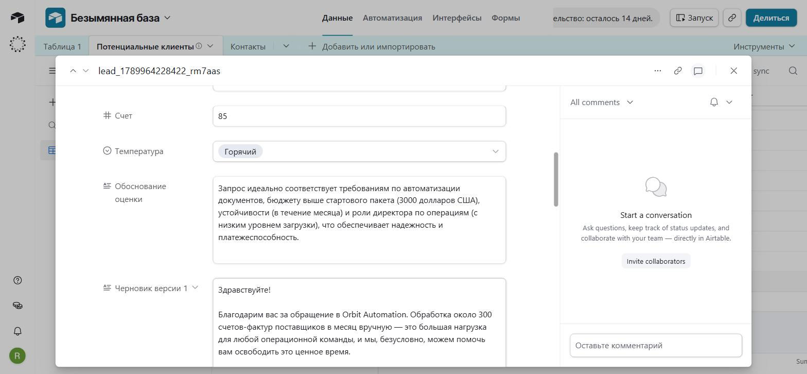
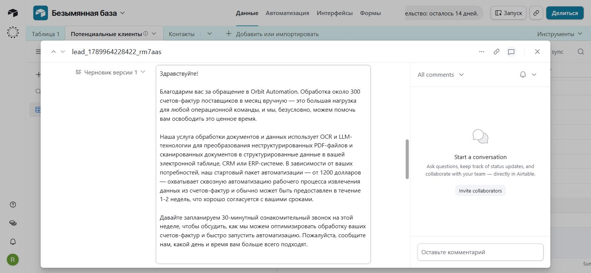
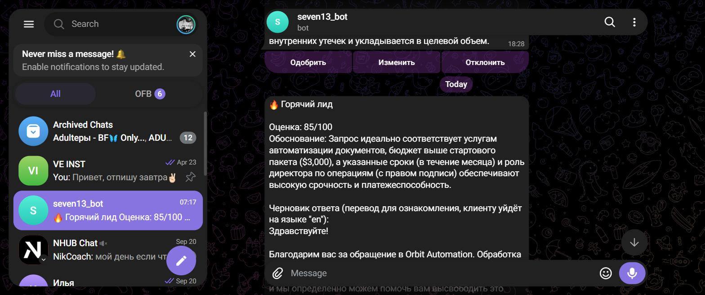
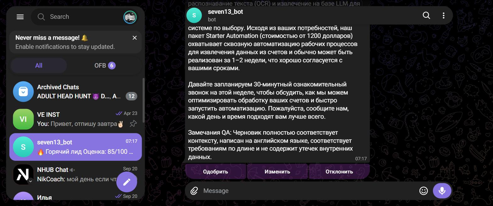

# Lead Copilot

**A multi-agent AI system that triages inbound sales leads end-to-end** — extracts intent from a
raw message, scores fit against an ICP rubric, drafts a personalized reply grounded in real
company docs (no hallucinated prices), self-reviews that draft, and pings a human on Telegram for
one-tap approve/edit/reject before anything goes out. Every stage is logged to Airtable with an
auto-computed time-saved metric.



## The problem

Sales teams burn hours a week manually reading, scoring, and replying to inbound leads. Most
"AI automation" fixes for this are a single ChatGPT prompt stapled to a webhook — no grounding
(the draft invents prices), no safety check (nothing catches a bad reply before it's sent), and no
visibility into whether it's actually helping. Lead Copilot treats this as a pipeline with four
distinct, auditable stages instead of one big prompt.

## How it works

```
Landing page (HTML form)
        │
        ▼
   n8n Webhook ──▶ Normalize ──▶ Guardrail (PII mask + prompt-injection neutralization)
                                                    │
                                                    ▼
                                    Agent A — Extractor (free text → structured JSON)
                                                    │
                                                    ▼
                                    Agent B — Qualifier (0-100 score, Hot/Warm/Cold, reasoning)
                                                    │
                                                    ▼
                        Agent C — Responder ──▶ RAG microservice (FastAPI + Chroma)
                              (drafts a reply grounded only in real company docs)
                                                    │
                                                    ▼
                              Agent D — QA Reviewer (checklist review, fixes or rejects)
                                                    │
                                                    ▼
                      Airtable (full audit trail of every stage) ──▶ Telegram
                                                          (score, reasoning, draft, Approve/Edit/Reject)
```

Any agent returning invalid JSON throws, retries automatically (3x), and never fails silently —
a broken step never means a lost lead.

## What makes this more than a ChatGPT wrapper

- **4 specialized agents, not one mega-prompt.** Extraction, scoring, drafting, and review are
  separate steps with separate system prompts and separate failure modes — matching how this is
  actually asked for in AI-automation job postings (see `../vacancies.md` in this portfolio).
- **RAG grounding against hallucination.** The Responder can only cite prices/services that exist
  in the company's real docs (`rag-service/docs/`) — it can't invent a discount or a feature.
- **A second agent checks the first one's work.** The QA reviewer re-reads the draft against the
  same source docs before a human ever sees it, and can reject a draft outright if the underlying
  lead looks like a prompt-injection attempt.
- **Prompt-injection and PII handling as a first-class step**, not an afterthought — tested by
  feeding the pipeline a lead message containing "ignore previous instructions" style text; it gets
  flagged (`suspicious_content`) rather than followed.
- **Human-in-the-loop by design.** Every lead — not just the "hot" ones — gets logged and routed to
  a person via Telegram before a reply is ever sent. The system drafts; a human decides.
- **Config-as-code.** The entire n8n workflow (17 nodes) is generated from a versioned script
  (`n8n/build-workflow.ps1`), not hand-clicked — prompts live as `.md` files the workflow reads off
  disk at runtime, so editing a prompt is a text edit, not a UI hunt.

## Results (from real test runs)

| Lead | Score | Outcome |
|---|---|---|
| "200 shipments/month, manual invoices, $2k budget, founder, 2 weeks" | 85/100 — Hot | Correctly recommended the Starter package, drafted a grounded reply, notified the team |
| "Automating support, budget unclear" | 45/100 — Warm | Correctly flagged missing budget/timeline signals |
| "Just curious, maybe later" | 15/100 — Cold | Correctly scored low, no false urgency |
| Larger budget / multi-process ask | 85/100 — Hot | Independently recommended the *Growth* package instead of Starter, based on scope — not templated |

End-to-end processing time: **8–12 seconds** per lead, fully automated up to the human approval
step.

## Demo

**Landing page → n8n webhook.** A visitor describes their problem; the form fires and the page
confirms instantly without waiting on the agent pipeline behind it.

| Before | After |
|---|---|
|  |  |

**Airtable — full audit trail.** Every stage the pipeline ran is logged against the lead: the
qualifier's score/temperature/reasoning, and the grounded draft reply.

| Score & reasoning | Grounded draft |
|---|---|
|  |  |

**Telegram — human-in-the-loop.** The sales team gets the score, the reasoning, a Russian
translation of the draft for internal review, and the QA reviewer's notes — with one-tap
Approve/Edit/Reject buttons before anything reaches the lead.

| Score & draft | Approve / Edit / Reject |
|---|---|
|  |  |

## Stack

n8n (self-hosted, Docker) · Gemini API (free tier) · FastAPI + Chroma (RAG) · Airtable · Telegram
Bot API · Postgres · Docker Compose

## Project structure

```
lead-copilot/
├── docker-compose.yml       # full stack: n8n, Postgres, RAG service, landing page, tunnel
├── n8n/
│   ├── build-workflow.ps1        # source of truth for the pipeline workflow (config-as-code)
│   ├── build-decision-handler.ps1  # reacts to the Telegram Approve/Edit/Reject buttons
│   └── workflow-export.json      # generated snapshot of the pipeline
├── prompts/                 # versioned system prompts, read off disk at runtime
├── rag-service/              # FastAPI + Chroma microservice grounding the draft agent
├── landing-page/             # the lead-intake form
└── scripts/start.ps1         # one-command local bootstrap
```

## Setup

### 1. Accounts you need to create yourself (external services — do these first)

- [ ] **Telegram bot**: message [@BotFather](https://t.me/BotFather) → `/newbot` → copy the token
      into `TELEGRAM_BOT_TOKEN`.
- [ ] **Your Telegram chat id**: message [@userinfobot](https://t.me/userinfobot) → copy your numeric
      id into `TELEGRAM_SALES_CHAT_ID`.
- [ ] **Gemini API key**: https://aistudio.google.com/apikey → create key → `GEMINI_API_KEY`.
      Free tier, no credit card required.
- [ ] **Airtable**: create a free account → new Base called "Lead Copilot" (schema below) →
      https://airtable.com/create/tokens → personal access token scoped to that base with
      `data.records:read` + `data.records:write` → `AIRTABLE_API_KEY`, `AIRTABLE_BASE_ID`.

### 2. What goes where

`.env` is read by **docker-compose** for Postgres credentials, n8n's own host/auth/encryption
config, and the RAG service's `GEMINI_API_KEY`. `TELEGRAM_BOT_TOKEN`, `AIRTABLE_API_KEY`, and a
second copy of `GEMINI_API_KEY` live as three **n8n credentials**, created via
`n8n/setup-credentials.ps1` rather than pasted through the UI:

| Credential name | n8n type | Used by |
|---|---|---|
| Lead Copilot Telegram | `telegramApi` | Telegram Trigger, Telegram Notify |
| Lead Copilot Airtable | `airtableTokenApi` | Airtable Create/Update Record |
| Lead Copilot Gemini | `httpQueryAuth` (query param `key`) | Agent A–D HTTP Request nodes |

### 3. Local setup

```powershell
cd lead-copilot
Copy-Item .env.example .env
# edit .env: fill in everything from step 1, plus generate random values for
# POSTGRES_PASSWORD, N8N_ENCRYPTION_KEY, N8N_BASIC_AUTH_PASSWORD
./scripts/start.ps1
./n8n/setup-credentials.ps1
./n8n/build-workflow.ps1
./n8n/build-decision-handler.ps1
```

`scripts/start.ps1` brings up Postgres, the RAG service, n8n, and a free SSH tunnel (no signup)
so n8n's webhooks are publicly reachable, then prints the resulting URL.

### 4. Airtable base schema (`Leads` table)

| Field | Type |
|---|---|
| Lead ID | Single line text |
| Raw Input | Long text |
| Source | Single select (Form / Email) |
| Extracted JSON | Long text |
| Score | Number |
| Temperature | Single select (Hot / Warm / Cold) |
| Scoring Reasoning | Long text |
| Draft v1 | Long text |
| QA Verdict | Single select (Pass / Fixed / Failed) |
| Final Draft | Long text |
| Human Decision | Single select (Approved / Edited / Rejected / Pending) |
| Processing Failed | Checkbox |
| Received At | Date (with time) |
| Processed At | Date (with time) |
| Minutes Saved | Formula: `((8 * 60) - DATETIME_DIFF({Processed At}, {Received At}, 'seconds')) / 60` |

## Status / known limitations

- The main pipeline (webhook → 4 agents → Airtable → Telegram) is built and verified against real
  test executions.
- The Telegram decision-handler workflow (reacting to Approve/Edit/Reject) is built and its node
  schema is validated, but hasn't had a full live end-to-end test — free SSH tunnel providers
  (tried: Cloudflare Quick Tunnel, serveo.net, localhost.run) have each hit availability issues
  in turn. The Airtable-update logic it depends on is proven separately via real executions.
  "Edit" marks the lead for manual follow-up rather than supporting a full in-Telegram rewrite.
- No real email/CRM "send" step is wired up — approving a draft currently marks it as approved in
  Airtable; actually sending it is where a company's real email/CRM integration would plug in.
- Internal Telegram notifications are in Russian (the target team's language); drafts sent to
  leads stay in the lead's own detected language.

Two more portfolio projects (a document-OCR agent, a RAG knowledge-base assistant) are scoped
separately and not part of this repo.
